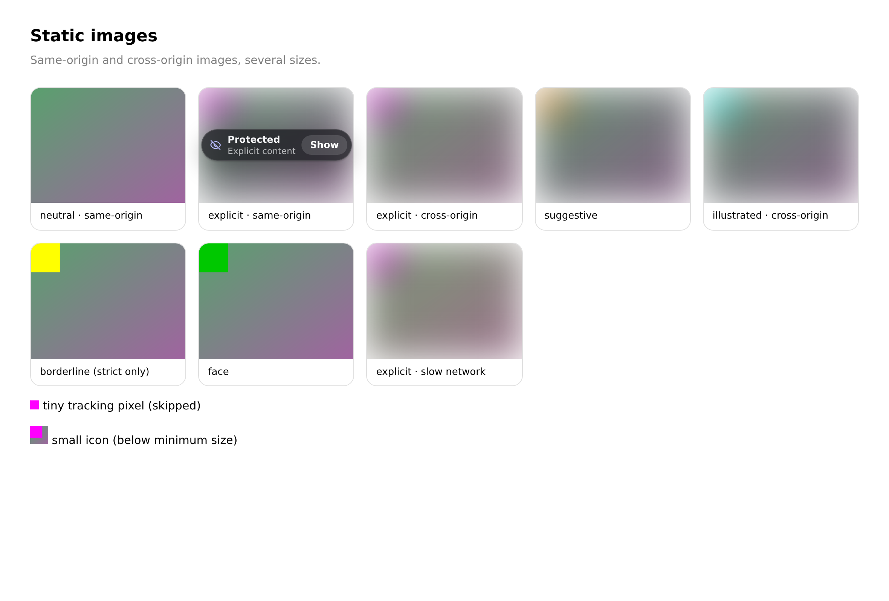
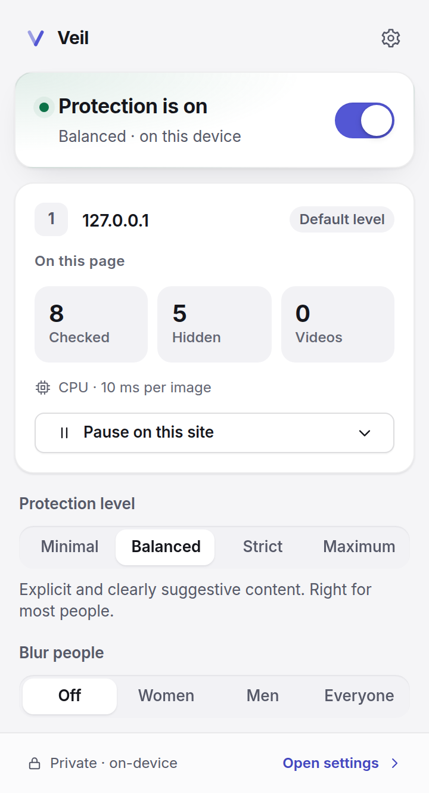
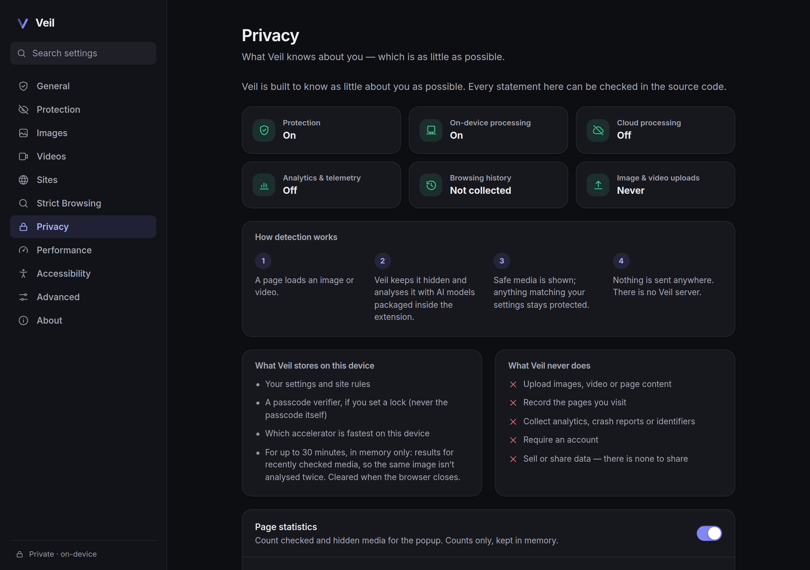

# Veil

**Private, on-device protection from unwanted images and video, for Chrome and Firefox.**

Veil hides explicit and other unwanted visual content **before it appears on screen**. It analyses
images and video with AI models that run **inside your browser**. Nothing you browse is uploaded,
logged or shared, and there is no Veil server.

<p align="center">
  
</p>

<p align="center">
  
  &nbsp;
  
</p>

## What it does

- **Hides media before it paints.** A stylesheet the browser injects before the page renders keeps
  new images, videos and inline backgrounds invisible until Veil has decided. The page layout
  doesn't move.
- **Understands modern pages:** lazy loading, `srcset`/`<picture>`, infinite feeds, single-page
  apps that recycle elements, open and closed shadow DOM, cross-origin iframes, `data:`/`blob:`
  images, animated GIF/WebP and video.
- **On-device AI:**
  - a content classifier (explicit, illustrated, suggestive);
  - optional face and person detectors that can blur just those regions;
  - an optional **people filter**: blur everyone, or only people who appear to be **women** or
    **men**, in images and videos. The estimate comes from each face, on your device. In video,
    the blur follows each matching person as they move; the rest of the video stays visible.

  Inference runs on WebGPU, WebGL, WebAssembly or CPU, whichever is fastest on your machine.

- **Four levels:** Minimal, Balanced, Strict and Maximum. You can also tune each category's
  sensitivity, use a stricter level on ads, and set a separate level per site.
- **Six protection styles:** soft blur, strong blur, pixelate, solid, placeholder and hide.
- **Reveal your way:** click, press-and-hold, hover or keyboard shortcut, optionally with a
  confirmation step, or not at all.
- **Video:** frames are sampled adaptively and re-checked on scene changes. Protection lifts
  automatically once the video is safe again (optional).
- **Sites:** pause, strengthen, warn or block any site, permanently or for a while. Wildcards are
  supported.
- **Strict Browsing:** enforces SafeSearch (Google, Bing, DuckDuckGo, Yahoo, Brave, Yandex) and
  YouTube Restricted Mode, and raises the protection floor.
- **Settings lock:** a passcode guards changes that weaken protection. Strengthening never needs
  it.
- **Managed deployment:** schools, organisations and families can pin settings with browser policy.
- **Accessible and localised:** full keyboard and screen-reader support, reduced motion, high
  contrast. Available in English, العربية (right-to-left) and Français.

## Privacy model

|                                     |                                                                                                             |
| ----------------------------------- | ----------------------------------------------------------------------------------------------------------- |
| Image and video analysis            | On your device, with models packaged in the extension                                                       |
| Uploads                             | **None.** No image, frame, page or URL leaves your browser                                                  |
| Browsing history                    | **Not recorded**, locally or remotely                                                                       |
| Analytics, telemetry, crash reports | **None**                                                                                                    |
| Accounts                            | **None**                                                                                                    |
| Network requests                    | Only re-fetching media a page already shows, without cookies or credentials, so the local model can read it |
| Stored on device                    | Your settings, a passcode _verifier_ if you set a lock, and the fastest-backend result                      |

The details, including every storage key, are in [docs/PRIVACY.md](docs/PRIVACY.md), and every
permission is explained in [docs/PERMISSIONS.md](docs/PERMISSIONS.md).

## How it works

```
page loads ──► gate hides new media (CSS, before first paint)
            ──► scanner finds media (DOM, shadow roots, frames) ──► visible-first queue
            ──► pixels or URL ──► background (cache) ──► offscreen worker: TF.js models
            ──► signals ──► policy (level, site rules, context) ──► show · protect · blur regions
```

Chrome hosts inference in an offscreen document, and Firefox in its background page. Both run the
same worker. Results are cached in memory, so a policy change re-decides the page instantly. See
[docs/ARCHITECTURE.md](docs/ARCHITECTURE.md).

## Browser support

| Browser                                     | Minimum | Notes                                          |
| ------------------------------------------- | ------- | ---------------------------------------------- |
| Chrome and Chromium browsers (Edge, Brave…) | 116     | Offscreen-document inference host              |
| Firefox (desktop)                           | 140     | Event page hosts the worker                    |
| Firefox for Android                         | 142     | Manifest-compatible; not yet tested on devices |

## Measured performance

On a 4-core cloud VM **without a GPU** (Chromium 141, WebAssembly backend):

|                                                  |                          |
| ------------------------------------------------ | ------------------------ |
| Classifier inference                             | 94 ms per image (median) |
| First image decided on a fresh page, engine warm | 276 ms after navigation  |
| Images seen before (cached)                      | 76 ms median             |
| `content.js` injected into pages                 | 72.5 KB (24 KB gzip)     |

GPU backends weren't available on the test machine, so they weren't measured. Full methodology
and caveats are in [docs/BENCHMARKS.md](docs/BENCHMARKS.md).

## Development

```sh
npm ci
npm run models          # fetch and verify the pinned models (~10 MB, not committed)
npm run dev             # Chrome dev build with watch → load dist/chrome as an unpacked extension
npm run dev:firefox     # Firefox → about:debugging → Load Temporary Add-on → dist/firefox/manifest.json
npm run lab             # compatibility lab at http://127.0.0.1:4700
```

Requires Node.js 20+. Build flags, store submission and model updates are covered in
[docs/RELEASE.md](docs/RELEASE.md).

## Testing

```sh
npm run check           # typecheck, lint, 162 unit + integration tests
npm run test:e2e        # 55 Playwright tests with the real extension in Chromium
npm run lint:firefox    # addons-linter on the Firefox build
npm run bench           # inference per backend and full-pipeline timings
npm run calibrate -- --data=<labelled folder>   # thresholds from your own data
```

End-to-end tests use deterministic "marker" images and a test model, so the full pipeline is tested
without any sensitive content in the repository. Two further tests run the real models on safe
photos. See [docs/TESTING.md](docs/TESTING.md), including the manual Firefox pass.

## Building and packaging

```sh
npm run build           # production builds → dist/chrome, dist/firefox
npm run package         # verified, reproducible zips → artifacts/ (Chrome, Firefox, source, SHA256SUMS)
```

## Known limitations

Veil reduces exposure; **it can't guarantee it.** Automated detection is imperfect: some
unwanted media will be missed, and some safe media will be hidden.

- **Accuracy is unmeasured on unsafe content.** Thresholds were checked on safe photos only. This
  project didn't collect explicit material, so recall hasn't been measured here. Use
  `npm run calibrate` on your own labelled data ([docs/ML.md](docs/ML.md)).
- **Common false positives:** skin-toned scenes (fruit, sand, wood), swimwear, classical art and
  medical imagery, especially at Strict and Maximum.
- **Not covered:**
  - background images set from **stylesheets** (only inline `style` backgrounds are);
  - `<canvas>`/WebGL drawings, SVG `<image>`, `<object>`/`<embed>`, CSS-generated content;
  - media smaller than the minimum size (default 36 px).
- **Cross-origin video without CORS** can't be read by any extension. It gets the _fallback_
  decision instead: shown at Minimal and Balanced, protected at Strict and Maximum.
- **The people filter estimates apparent gender from faces and can be wrong.** In a small labelled
  test it misjudged 1 face in 60 and was unsure about 1 in 10 (unsure faces follow your "When
  unsure" choice). People with no visible face count as unsure. See
  [docs/ML.md](docs/ML.md#people-filter-women-men-or-everyone).
- **Region blurring in video follows people by prediction.** Frames are analysed a few times a
  second, and in between each blur moves with the person's recent motion, with a margin that grows
  until the next analysis. Very fast motion, someone stepping into the frame, or a scene cut the
  frame check doesn't notice can leave a person visible for a fraction of a second. When the video
  element itself is fullscreen or in picture-in-picture, nothing can be drawn over it, so the whole
  video is protected instead. See [docs/ML.md](docs/ML.md#people-filter-women-men-or-everyone).
- On sites whose Content Security Policy forbids `data:` images, region protection for images
  falls back to protecting the whole image.
- **Pages built to evade filters** (serving different images to the analyser, drawing to canvas,
  overriding CSS) can get around any extension ([docs/SECURITY.md](docs/SECURITY.md)).
- **The lock is a deterrent, not a barrier.** Anyone who can manage extensions can remove Veil, and
  extensions don't run in private windows unless allowed. Use browser policy for enforced setups
  ([docs/DEPLOYMENT.md](docs/DEPLOYMENT.md)).
- **Browser-internal pages** and extension stores can't be protected by any extension.
- **Speed depends on hardware.** On a machine without a GPU, a page full of new images takes about
  a second to settle (images stay hidden until decided).
- Firefox support is verified by linting and a manual checklist, not by automated browser tests.
- The people filter adds a 6.7 MB model (loaded only when used) and, on CPU-only machines, about
  90 ms per face, so crowded pages take longer to settle.

## Documentation

|                                               |                                                                        |
| --------------------------------------------- | ---------------------------------------------------------------------- |
| [ARCHITECTURE](docs/ARCHITECTURE.md)          | Components, the life of an image, video, policy, DNR, trust boundaries |
| [PRIVACY](docs/PRIVACY.md)                    | Privacy policy and storage inventory                                   |
| [PERMISSIONS](docs/PERMISSIONS.md)            | Every permission and why                                               |
| [SECURITY](docs/SECURITY.md)                  | Threat model, hardening, reporting vulnerabilities                     |
| [ML](docs/ML.md)                              | Models, scoring, thresholds, calibration, limitations                  |
| [BENCHMARKS](docs/BENCHMARKS.md)              | Measured performance and how to reproduce it                           |
| [TESTING](docs/TESTING.md)                    | Test layers, compatibility lab, Firefox checklist                      |
| [RELEASE](docs/RELEASE.md)                    | Setup, builds, packaging, store submission                             |
| [DEPLOYMENT](docs/DEPLOYMENT.md)              | Managed policies for Chrome, Edge and Firefox; family setups           |
| [DESIGN_SYSTEM](docs/DESIGN_SYSTEM.md)        | Principles, tokens, components, voice                                  |
| [ACCESSIBILITY](docs/ACCESSIBILITY.md)        | What's supported and how it is verified                                |
| [I18N](docs/I18N.md)                          | Languages, RTL, adding a language                                      |
| [THIRD_PARTY_NOTICES](THIRD_PARTY_NOTICES.md) | Libraries, models and font licences                                    |
